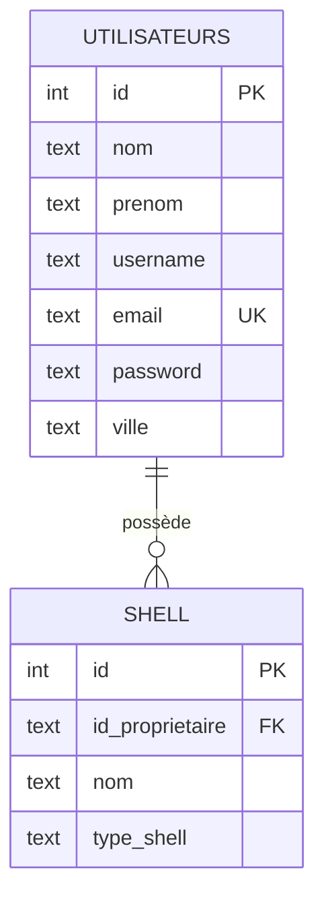
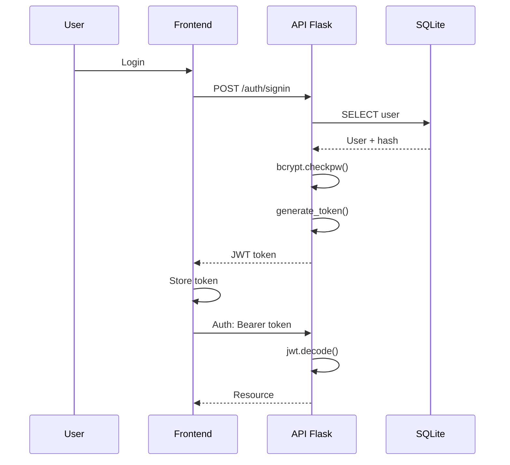
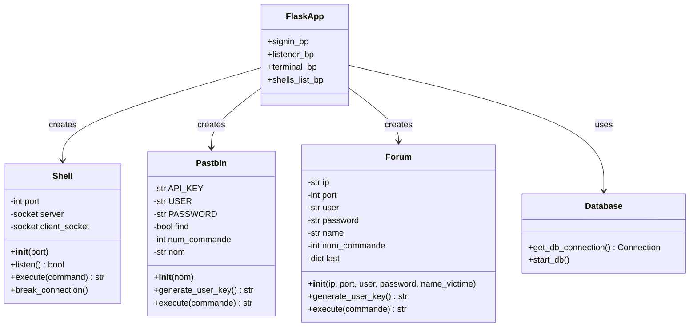
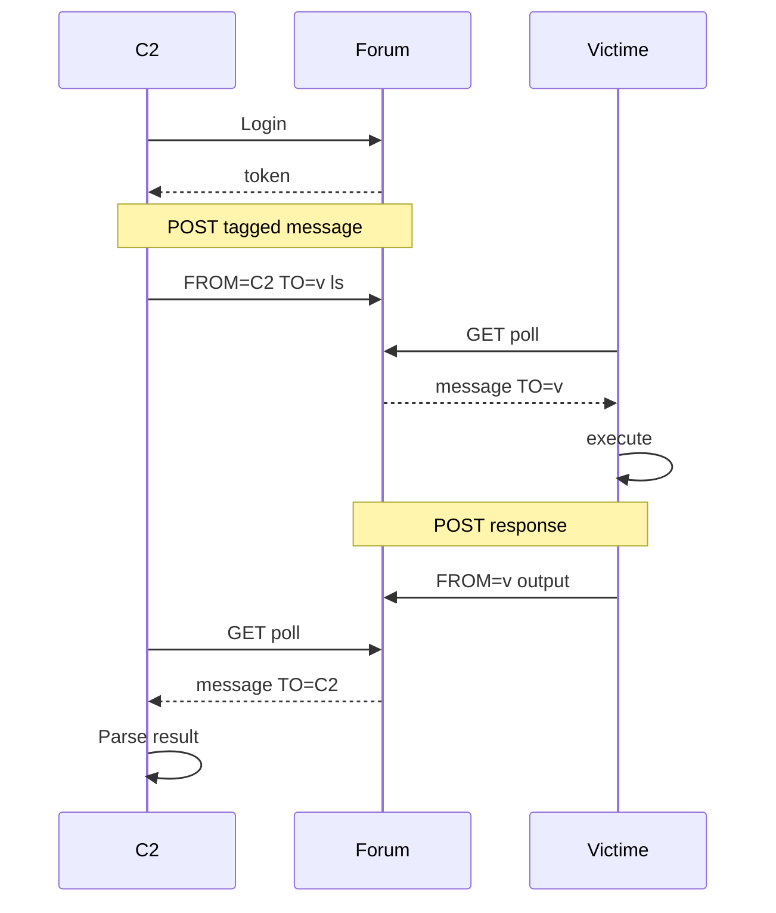
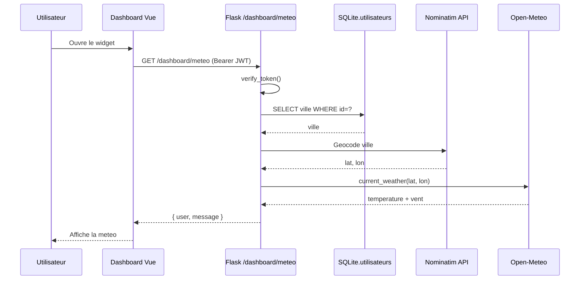
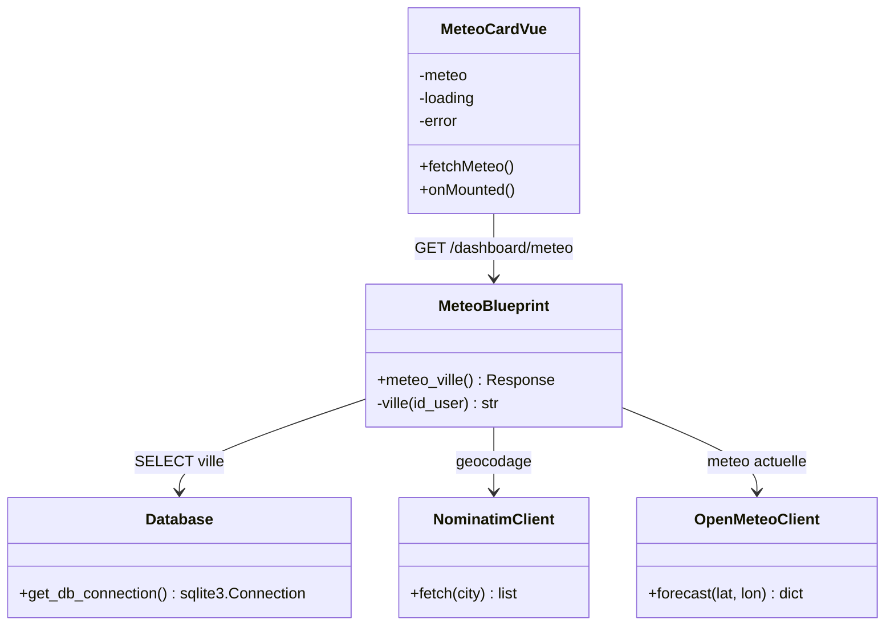
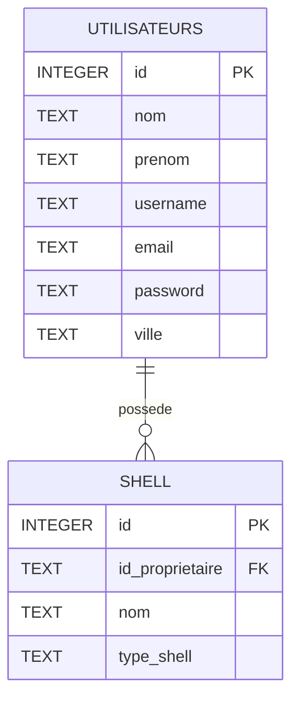

```mermaid {scale: 0.5}
graph TB
    A[Frontend Vue 3] -->|HTTP/JWT| B[Backend Flask]
    B -->|SQLite| C[(Database)]
    B -->|Socket| D[Reverse Shell]
    B -->|API| E[Pastebin]
    B -->|HTTP| F[Forum]
    D -->|Commandes| G[Agent Windows]
    E -->|Polling| H[Agent Pastebin]
    F -->|Messages| I[Agent Forum]

    style A fill:#42b883
    style B fill:#e44d26
    style C fill:#003b57
```

# Projet C2
## Command & Control Platform

Système de contrôle et de commande distribué avec backend Flask et frontend Vue 3

<div class="abs-br m-6 text-sm">
  Présentation technique
</div>

---
transition: fade-out
layout: two-cols
---

# Vue d'ensemble

Plateforme C2 complète permettant de :

- 🔐 **Authentification sécurisée** - JWT avec bcrypt
- 🎯 **Multi-agents** - Gestion de plusieurs shells simultanés
- 🌐 **Listeners variés** - Reverse shell, Pastebin, Forum
- 💻 **Interface moderne** - Dashboard Vue 3 responsive
- 🗄️ **Base de données** - SQLite pour la persistance
- 🔄 **Communication temps réel** - Exécution de commandes à distance

::right::

<div class="mt-12">

## Architecture



</div>

---
layout: default
---

# Architecture du projet

<div class="grid grid-cols-2 gap-4">

<div>

## Structure des dossiers

```
C2/
├── backend/              # API Flask
│   ├── app/
│   │   ├── api/routes/  # Endpoints
│   │   └── jwt_handler.py
│   ├── DB/              # SQLite
│   └── app.py
├── frontend/            # Interface Vue 3
│   ├── src/
│   │   ├── views/
│   │   ├── components/
│   │   └── router/
│   └── vite.config.js
├── charge_utile/        # Agents
│   ├── charge_windows.py
│   └── relay_forum/
└── forum/               # Infrastructure forum
```

</div>

<div>

## Stack technique

**Backend**
- Flask (API REST)
- SQLite (base de données)
- JWT (authentification)
- bcrypt (hachage passwords)
- Socket (reverse shell)

**Frontend**
- Vue 3 (framework)
- Vite (build tool)
- Axios (HTTP client)
- Vue Router (routing)

**Agents**
- Python 3.12
- Requests (HTTP)
- Socket (networking)

</div>

</div>

---
layout: center
---

# Base de données SQLite

<div class="grid grid-cols-2 gap-8">

<div>

## Schéma relationnel



</div>

<div class="pt-4">

## Structure SQL

**Table `utilisateurs`**

```sql
CREATE TABLE utilisateurs (
    id INTEGER PRIMARY KEY,
    nom TEXT NOT NULL,
    prenom TEXT NOT NULL,
    username TEXT NOT NULL,
    email TEXT UNIQUE NOT NULL,
    password TEXT NOT NULL,
    ville TEXT NOT NULL
);
```

**Table `shell`**

```sql
CREATE TABLE shell (
    id INTEGER PRIMARY KEY,
    id_proprietaire TEXT NOT NULL,
    nom TEXT NOT NULL,
    type_shell TEXT NOT NULL,
    FOREIGN KEY (id_proprietaire)
        REFERENCES utilisateurs(id)
);
```

</div>

</div>

---
layout: default
---

# Authentification JWT

<div class="grid grid-cols-2 gap-4">

<div>

## Workflow



</div>

<div>

## Code: `jwt_handler.py`

```python {all|3-5|7-12|14-21}
# Génération de token
def generate_token(user_id):
    payload = {
        "user_id": user_id,
        "exp": datetime.utcnow() +
               timedelta(seconds=86400)
    }
    return jwt.encode(
        payload, SECRET_KEY, "HS256"
    )

# Vérification
def verify_token(token):
    try:
        decoded = jwt.decode(
            token, SECRET_KEY,
            algorithms=["HS256"]
        )
        return {"success": True}
    except jwt.ExpiredSignatureError:
        return {"error": "Token expiré"}

# Décorateur de protection
@token_required
def protected_route():
    user_data = g.user_data
    # ...
```

</div>

</div>

---
layout: center
---

# Diagramme de classes UML



---
layout: default
---

# Types de Listeners

<div class="grid grid-cols-2 gap-4">

<div>

## 1. Reverse Shell

**Fichier**: `shell.py:13-36`

```python
class Shell:
    def __init__(self, port):
        self.port = port

    def listen(self):
        self.server = socket.socket(socket.AF_INET, socket.SOCK_STREAM)
        self.server.bind((HOST, self.port))
        self.server.listen(1)
        self.client_socket, _ = self.server.accept()

    def execute(self, command):
        self.client_socket.sendall(command.encode())
        return self.client_socket.recv(4096).decode(errors='ignore')
```

</div>

<div>

## 2. Pastebin Relay

**Fichier**: `shell.py:38-138`

Utilise l'API Pastebin pour C&C

```python
def execute(self, commande):
    api_user_key = self.generate_user_key()
    requests.post(paste_url, data=data)
    while not self.find:
        time.sleep(10)  # scrute le paste de réponse
    return self.last["body"]
```

## 3. Forum Relay

**Fichier**: `shell.py:140-244`

Messages taggués sur forum

</div>

</div>

---
layout: default
---

# Listener Forum - Communication cachée

<div class="grid grid-cols-2 gap-4">

<div>

## Architecture



</div>

<div>

## Classe Forum (résumé)

- Initialise la connexion au forum (IP, port, identifiants).
- `generate_user_key()` récupère le token API utilisé pour les requêtes.
- `execute()` publie la commande tagguée puis attend la réponse correspondante.

</div>

</div>

---
layout: default
---

# Format des messages Forum

## Protocol de tagging

Les messages utilisent un format structuré pour identifier l'émetteur, le destinataire et la séquence :

```plaintext
[FROM=émetteur];[TO=destinataire];[SEQ=numéro]; contenu_du_message
```

<div class="grid grid-cols-2 gap-4 mt-8">

<div>

### Exemple: Commande C2 → Victime

```plaintext
[FROM=C2];[TO=victime_2];[SEQ=42]; whoami
```

**Parsing côté victime (résumé):**
- Vérifie que `TO` cible bien la victime avant d'exécuter.
- Répond avec le même `SEQ` pour que le C2 puisse rapprocher la commande.

</div>

<div>

### Exemple: Réponse Victime → C2

```plaintext
[FROM=victime_2];[TO=C2];[SEQ=42]; DESKTOP\user
```

**Parsing côté C2 (résumé):**
- Valide `FROM`, `TO` et `SEQ` avant d'accepter la réponse.
- Ne conserve que le contenu utile pour l'affichage.

</div>

</div>

---
layout: two-cols
class: text-sm
---

# Frontend Vue 3

## Structure des views

```
frontend/src/views/
├── signin.vue       # Connexion
├── signup.vue       # Inscription
├── dashboard.vue    # Tableau de bord
└── terminal.vue     # Terminal multi-shell
```

## signin.vue (logique)

- Utilise le composant `<script setup>` avec `ref` pour gérer email/mot de passe.
- Soumet un POST sur `/auth/signin` et stocke le JWT en local en cas de succès.
- Redirige vers `/dashboard` ou affiche un message d'erreur utilisateur.

::right::

<div class="pt-4">

## Configuration Axios

- Intercepteur global qui ajoute l'en-tête `Authorization` quand un token est présent.
- Les erreurs sont renvoyées telles quelles pour être gérées par chaque vue.

## Router protection

- Garde de navigation qui redirige vers `/signin` quand la route est protégée.
- Autorise le flux normal si un token est disponible ou si la route est publique.

</div>

---
layout: default
class: text-sm
---

# Variables d'environnement

<div class="grid grid-cols-2 gap-4">

<div>

## Backend: `backend/.env`

```bash
# JWT Configuration
SECRET_KEY=votre-cle-secrete-tres-longue
JWT_EXPIRATION_DELTA=86400

# Pastebin API (optionnel)
API_KEY=votre-api-key-pastebin
USER_PAST=votre-username-pastebin
PASSWORD=votre-password-pastebin
```

**Utilisation dans le code (résumé):**
- Chargement via `python-dotenv` dans `app.py` au démarrage.
- `SECRET_KEY` et `JWT_EXPIRATION_DELTA` pilotent la génération de tokens.
- Les identifiants Pastebin sont optionnels selon le listener configuré.

</div>

<div>

## Frontend: `frontend/.env`

```bash
VITE_API_URL=http://127.0.0.1:5000
```

**Utilisation dans Vue:**
- Les variables exposées doivent commencer par `VITE_` pour être injectées.
- `import.meta.env.VITE_API_URL` fournit la base API utilisée par Axios.

**Important:**
- Les variables frontend doivent commencer par `VITE_`
- Elles sont exposées côté client
- Ne jamais y mettre de secrets!

</div>

</div>

---
layout: center
class: text-sm
---

# Démo: Utilisation complète

<div class="grid grid-cols-3 gap-4">

<div>

## 1. Setup

```bash
# Backend
cd backend
python -m venv .venv
source .venv/bin/activate
pip install -r requirements.txt
python -m DB
python app.py
```

```bash
# Frontend
cd frontend
npm install
npm run dev
```

</div>

<div>

## 2. Création compte

1. Ouvrir `http://localhost:5173`
2. Aller sur `/signup`
3. Remplir le formulaire
4. Créer le compte

## 3. Connexion

1. Aller sur `/signin`
2. Entrer email + password
3. Recevoir JWT token
4. Redirection vers `/dashboard`

</div>

<div>

## 4. Créer un listener

1. Dans dashboard, cliquer "New Listener"
2. Choisir le type:
   - Reverse Shell → Port
   - Pastebin → Nom
   - Forum → IP, Port, Credentials
3. Valider
4. Le shell apparaît dans la liste

## 5. Exécuter des commandes

1. Aller sur `/terminal`
2. Sélectionner shells
3. Entrer commande
4. Voir résultats multi-shell

</div>

</div>

---
layout: two-cols
class: text-sm
---

# Sécurité

## Points forts

✅ Authentification JWT robuste

✅ Hachage bcrypt des passwords

✅ Tokens avec expiration

✅ Décorateur `@token_required`

✅ Foreign keys SQLite activées

✅ Variables d'environnement pour secrets

## Points d'amélioration

::right::

<div class="pt-10">

- ⚠️ HTTPS obligatoire pour protéger les tokens.
- ⚠️ Rate limiting sur `/signin` contre le bruteforce.
- ⚠️ Valider les commandes avant exécution distante.

</div>

---
layout: default
---

# Dashboard Meteo

- Widget Vue 3 affichant une meteo personnalisee pour l'utilisateur connecte.
- Secured by JWT: l'identite est extraite via `g.user_data` cote backend.
- Donnees agregees en direct depuis Nominatim (geocodage) et Open-Meteo.
- La colonne `ville` de `utilisateurs` conditionne l'acces au service.

---
layout: default
class: text-sm
---

# Chaine de traitement



**Points cles**

- `token_required` bloque toute requete sans JWT valide.
- Deux appels reseau successifs: Nominatim puis Open-Meteo.
- Timeout fixe a 5 s pour garder l'API reactive.

---
layout: center
---

# UML - Modules Meteo



---
layout: default
class: text-sm
---

# Base de donnees

<div class="grid grid-cols-1 md:grid-cols-2 gap-6 items-start">
<div>



</div>

<div>

**Relations clefs**

- `shell.id_proprietaire` pointe vers `utilisateurs.id` (clé étrangère).
- `utilisateurs.ville` alimente la météo; valeur obligatoire.
- Supprimer un utilisateur nécessite de retirer d'abord ses shells.

</div>
</div>

---
layout: default
class: text-sm
---

# Backend `/dashboard/meteo`

```python {all|7-13|16-33|35-48}
@meteo.route('/meteo', methods=['GET'])
@token_required
def meteo_ville():
    user_id = g.user_data["user_id"]
    return jsonify({
        "message": ville(user_id),
        "user": user_id
    }), 200


def ville(id_user):
    conn = get_db_connection()
    cursor = conn.cursor()
    cursor.execute("""
        SELECT ville
        FROM utilisateurs
        WHERE id = (?)
    """, (id_user,))
    row = cursor.fetchone()
    if row is None:
        return "Ville non trouve"

    ville = row[0]
    conn.close()
    geo_url = f"https://nominatim.openstreetmap.org/search?city={ville}&format=json"
    try:
        geo = requests.get(geo_url, headers=HEADERS, timeout=5).json()
    except (requests.RequestException, ValueError):
        return "Service meteo indisponible"

    if not geo:
        return "Ville introuvable"

    lat, lon = geo[0]["lat"], geo[0]["lon"]
    meteo_url = f"https://api.open-meteo.com/v1/forecast?latitude={lat}&longitude={lon}&current_weather=true"
    try:
        data = requests.get(meteo_url, headers=HEADERS, timeout=5).json()
    except (requests.RequestException, ValueError):
        return "Service meteo indisponible"

    current = data.get("current_weather") or {}
    temp = current.get("temperature")
    wind = current.get("windspeed")
    if temp is None or wind is None:
        return "Donnees meteo indisponibles"
    return f"Meteo a {ville} : {temp} degC, vent {wind} km/h"
```

**Points clefs**

- `token_required` extrait l'identite depuis `g.user_data` sans parametre client.
- Deux appels externes (Nominatim, Open-Meteo) sont encapsules avec timeout 5 s.
- Chaque branche d'erreur retourne un message exploitable par le frontend.

---
layout: default
class: text-sm
---

# Frontend `meteo.vue`

```ts {all|3-9|15-27|29-41}
const meteo = ref({ user: '', message: '' })
const loading = ref(true)
const error = ref('')

const apiClient = axios.create({
  baseURL: (import.meta as any).env?.VITE_API_URL || 'http://127.0.0.1:5000',
})

async function fetchMeteo() {
  try {
    const token = sessionStorage.getItem('token')
    const { data } = await apiClient.get('/dashboard/meteo', {
      headers: token ? { Authorization: `Bearer ${token}` } : {},
    })
    meteo.value = data
  } catch (e) {
    error.value = 'Impossible de recuperer la meteo.'
  } finally {
    loading.value = false
  }
}

onMounted(fetchMeteo)
```

**UX et bonnes pratiques**

- Token stocke dans `sessionStorage` pour limiter la persistance.
- Etats `loading` et `error` garantissent un feedback utilisateur clair.
- La vue affiche directement le message formate par le backend.

---
layout: center
class: text-center
---

# Merci!

Questions?

<div class="mt-8">


🔗 GitHub: https://github.com/tit6/C2

📚 Documentation: C2_Doc.pptx

</div>

<style>
h1 {
  background-color: #2B90B6;
  background-image: linear-gradient(45deg, #4EC5D4 10%, #146b8c 20%);
  background-size: 100%;
  -webkit-background-clip: text;
  -moz-background-clip: text;
  -webkit-text-fill-color: transparent;
  -moz-text-fill-color: transparent;
}
</style>
